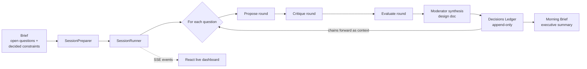

# AgentTeamDiscussions

**A multi-agent AI discussion engine that turns a product idea into a planning package by running structured debates between AI agents with distinct personalities, and doing it unattended.**

You hand it a brief with a list of open design questions. A team of AI agents works through each question in rounds: some propose, others critique, others evaluate. A neutral moderator then writes up a design document for each question. Decisions go into an append-only ledger that later questions build on, and the session ends with a "Morning Brief", an executive summary you can read in about 90 seconds.

Built in C# / .NET 8 with a React 19 live dashboard. It calls Claude through the Claude CLI.

> **Status:** mostly an experiment. This is a research prototype that works end to end and is tested, but it exists to explore an open question: can structured personas and anti-convergence mechanisms make multi-agent AI discussion genuinely diverse? See [Status](#status-mostly-an-experiment).

---

## Why This Exists

For a solo builder, planning is the bottleneck, not coding. Thinking through edge cases, resolving architectural tradeoffs and writing requirements usually takes a cross-functional team to catch blind spots.

A single AI conversation doesn't solve that. One model gives one perspective. It tends to agree with you, takes the safe path, and misses what a skeptical engineer or a demanding product person would catch. **The goal here is a team that argues instead of an assistant that agrees.**

The hard technical problem is **LLM convergence**: six "different" agents usually produce six versions of the same polite, safe answer. Most of this project is about engineering against that.

---

## How a Session Works



1. **Brief in.** A markdown file lists what's already decided and the open questions (or you start an interactive session from the CLI or the web UI).
2. **Rounds per question.** Each question goes through rounds defined by the team's *mode*, for example two proposers, two critics and two evaluators. Agents speak in a computed order, so later speakers respond to what earlier ones said.
3. **Synthesis.** A neutral moderator merges the rounds into one design document with explicit `DECIDED` / `OPEN` entries.
4. **Ledger.** Decisions are pulled into an append-only ledger. It is never edited and never summarized, and it is passed as context to every later question so the discussion builds on itself instead of re-arguing settled points.
5. **Morning Brief.** At the end, an LLM pass over the ledger writes an executive summary covering what was decided, what's risky and what needs a human.
6. **Optional evaluation.** A separate LLM-as-judge pass scores design docs and transcripts on clarity, completeness, actionability, engagement and diversity.

### Sample Output

Excerpt from a real Morning Brief (`_SYSTEM/projects/engine/output/sessions/2026-03-26_1839_knowledge-builder-review/summary.md`), where the team reviewed another project's architecture:

> **Q2: Is the researcher/organizer split the right pipeline architecture?**
> 8 decisions were reached:
> 1. The Organizer Agent is eliminated.
> 2. Researchers own their own metadata.
> 3. Routing is deterministic and path-local.
> 4. New hierarchy nodes require an explicit approval gate.
> 5. Conflicts are first-class file artifacts.
> ...

The same brief also flagged its own failure for Q1 ("Ledger extraction failed for Q1 -- read the design document directly"). The system reports degraded output instead of hiding it.

---

## Engineering Against Convergence

### A 6-Layer Agent Model

Each agent is defined entirely in YAML across six independent layers. No C# changes are needed to add agents or teams.

| Layer | What it controls |
|---|---|
| **Personality** | 8 scalar traits (0.0-1.0): assertiveness, creativity, risk tolerance, stubbornness, bluntness, patience, idea receptivity, attention span. Also cognitive style, emotional baseline and domain affinities. |
| **Position** | Role, *drives* (what they fight for), *pushback triggers*, intensity |
| **Technique** | Primary thinking method (e.g. adversarial review) and concrete behaviors |
| **Anti-Slop** | Countermeasures against LLM convergence (see below) |
| **Voice** | Tone, brevity, vocabulary hints and a list of phrases the agent must never use |
| **Output** | Operating altitude (requirements / design / implementation) and job (propose / critique / evaluate) |

Excerpt from `beta-agents__adversarial_critic.yaml`:

```yaml
personality:
  assertiveness: 0.9
  stubbornness: 0.9
  idea_receptivity: 0.2
  bluntness: 0.95
  patience: 0.1
position:
  role: adversarial reviewer
  drives:
  - find 5+ problems per proposal
  - expose unstated assumptions
  pushback_on:
  - '''the system will handle it'''
  - happy-path-only designs
anti_slop:
  agreement_tax: true
  devils_advocate_duty: true
  uncomfortable_idea_quota: 3
voice:
  tone: blunt and unimpressed
  anti_patterns:
  - That's a great idea!
  - I completely agree
  - As an AI
```

**The LLM never sees the raw numbers.** `PromptBuilder` turns scalar traits into natural-language prose that reads as lived experience ("You instinctively distrust..."), because instructions written as instincts hold up better across stateless calls than rules written as directives.

### Anti-Slop Mechanisms

- **Agreement tax.** An agent can't just agree. It has to add something new or name a weakness in the position it's endorsing.
- **Devil's advocate duty.** Assigned agents must argue against the emerging consensus.
- **Uncomfortable idea quota.** Agents are periodically required to raise an idea that makes the room uneasy.
- **Perspective enforcement.** A short identity reminder is injected every turn to stop drift toward a generic helpful-assistant voice.
- **Altitude guardrails.** Agents stay at the requirements and design level: no code, schemas or pseudocode, only components, interfaces and data flows. Every system prompt ends with a self-verification check.
- **Behavioral realism.** Low-patience agents get a truncated history window, as a real impatient reviewer would skim. Low-receptivity agents are told to focus on their own perspective instead of building on others'.

### Discussion Modes and Role Overlays

Each team defines its own *modes*, which are round structures plus optional behavioral overlays (`competitive`, `minimalist`, `maximalist`, `contrarian`, `operator`, `user_first`). For example, the general-purpose `beta-agents` team ships with 8 modes:

| Mode | Structure |
|---|---|
| `compete` (default) | Competitive vs. minimalist proposers go head to head |
| `counter` | One agent proposes; a second *must* counter-propose |
| `bigsmall` | Maximalist vs. minimalist |
| `angles` | Contrarian vs. operator, with a user-first evaluator |
| `ideas_compete` | Wild idea generator vs. minimalist orchestrator |
| `lean` | 4-agent reduced panel |

### Speaking Order

Within a round, agents are ordered by `assertiveness * 0.5 + intensity * 0.3 + stubbornness * 0.2 + jitter`. High scorers set the agenda and later speakers have to respond to them. The small random jitter stops the same agent from always going first.

---

## Architecture

### Three-Layer Prompt Assembly

Every agent turn is a **stateless** `claude -p` call, with context rebuilt from disk each time. The prompt is assembled in three layers:

| Layer | Size | Contents | Cuttable? |
|---|---|---|---|
| **Identity** | ~2K tokens, static | Persona, personality-as-prose, position, technique, anti-slop, voice | No |
| **Situation** | ~3-5K tokens, dynamic | Decisions ledger, compressed prior rounds, prior design docs, unresolved questions | Yes, in priority order |
| **Task** | ~500 tokens | The question, round instruction, perspective reminder | Never |

The order is deliberate: identity frames how the agent reads the situation, and the situation frames the task.

### Context Budget Enforcement and Telemetry

Prompts are built as named, measured sections rather than one concatenated string. `ContextTelemetry` records a snapshot of every turn (tokens per section, share of budget), and `ContextBudgetEnforcer` handles overflow:

- It detects **over-budget** payloads and **imbalanced** ones, where one section takes up most of the context.
- It trims sections in a fixed cut priority (`prior_rounds` -> `prior_specs` -> `decisions` -> ...), in passes of 50%, then 25%, then removal.
- It truncates from the *front* at line boundaries to keep the most recent content.
- It never touches protected sections, such as the perspective reminder.

Prior rounds are compressed by `DiscussionCompressor`, which keeps each agent's `## Position Summary` instead of the full response. Each round gets the gist of the last one without bloating the context. Per-turn telemetry is streamed to the dashboard's Inspector tab.

### Built to Run Unattended

The system is meant to run for hours without anyone watching, so failure handling is a first-class design concern:

- **Crash recovery from artifacts.** Every file is written with a `<!-- complete -->` marker. On `--resume`, progress is worked out from what's on disk. Files without the marker are regenerated, so there's no separate checkpoint file that can go out of sync.
- **Cascade error rules.** If the propose round fails, the question is skipped. If critique or evaluate fails, partial work is saved and the question is marked partial. If synthesis fails, the transcript is kept without a design doc.
- **Circuit breaker.** Three consecutive question failures stop the session instead of burning hours on a broken run.
- **Health checks.** There are minimum response lengths, and the ratio of ledger decisions to design-doc decisions is checked to catch extraction hallucination.
- **Resilient subprocess wrapper.** `ClaudeRunner` retries on timeout, empty output or non-zero exit, with backoff. It never throws. Instead it returns tagged error strings that downstream health checks detect. It handles Windows (`cmd.exe /c`) and Unix differently.

### Live Dashboard

An ASP.NET Core server streams session events over **Server-Sent Events** to a React 19 + TypeScript + Tailwind dashboard:

- **Setup page.** Pick a brief or topic, a team and agents, then start or stop sessions (`/api/session/start`, `/api/session/stop`).
- **Chat panel.** Agent turns stream in as they happen, with per-agent colors and a "thinking" state.
- **Roster.** Each agent's personality trait bars and profile.
- **Ledger panel.** Decisions as they're extracted.
- **Inspector.** The exact prompt each agent received and its context telemetry breakdown.
- **Moderator bar.** Inject a message or add a new question into a running session.

### Code Organization

```
Program.cs              CLI (System.CommandLine) + DI container
Abstractions/           Interfaces: IClaudeRunner, IPromptBuilder, IRoundRunner,
                        IContextBudgetEnforcer, ISessionPersistence, ...
Session/                SessionPreparer, SessionRunner, SessionPersistence, DecisionsLedger
Discussion/             DiscussionEngine (rounds + synthesis), RoundRunner, DiscussionCompressor
Agents/                 AgentConfig (6-layer model), AgentLoader, PromptBuilder
Telemetry/              ContextTelemetry, ContextBudgetEnforcer
Runner/                 ClaudeRunner (subprocess wrapper)
Synthesis/              MorningBriefGenerator
Evaluation/             Evaluator (LLM-as-judge scoring)
Live/                   LiveServer (SSE + REST), SessionManager, SseSessionEmitter
```

All services sit behind interfaces and are wired through dependency injection. Behavior is **configuration-driven**: timeouts, truncation limits, health-check thresholds and context budgets live in `config/defaults.yaml`, prompts are Scriban templates in `templates/`, and teams, agents and modes are YAML in `_SYSTEM/data/`.

---

## Tech Stack

| Layer | Technology |
|---|---|
| Engine | C# / .NET 8, ASP.NET Core (Web SDK) |
| CLI | System.CommandLine |
| LLM | Claude via the Claude CLI (`claude -p` subprocess) |
| Config and data | YAML (YamlDotNet) |
| Prompt templates | Scriban (Jinja2-compatible) |
| Dashboard | React 19, TypeScript, Vite, Tailwind CSS 4, React Router |
| Streaming | Server-Sent Events |
| Tests | xUnit, **105 tests passing** |

The test suite covers agent loading, brief parsing, config loading, prompt building (including history-windowing edge cases), context telemetry, budget enforcement, discussion compression, the decisions ledger, crash-safe persistence and session configuration.

---

## Research Foundation

Design decisions draw on a body of research kept in `docs/research/`:

- **Engineering Robust Multi-Agent LLM Discussions.** Keeping agents at the right altitude, role differentiation, the agreement tax, and running independent first rounds to avoid anchoring.
- **Making Agents Not Act Like AI.** 10 research domains and 40+ mechanisms from cognitive diversity and organizational psychology, mapped to concrete engine features in `research-applied.md`.

The project also uses itself. Several sessions in `output/sessions/` are the agent team reviewing the engine's own spec gaps, discussion mechanics and codebase duplication, and those findings fed back into development.

---

## Getting Started

### Prerequisites

- .NET 8 SDK
- [Claude Code CLI](https://docs.anthropic.com/en/docs/claude-code) installed and authenticated (`claude` on PATH)
- Node.js (only for the live dashboard)

### Run

```bash
cd _SYSTEM/projects/engine
dotnet build
dotnet test

# Interactive: prompts for topic, team, agents, mode
dotnet run --project src/EngineStandalone -- new

# One-liner with a chosen subset of agents
dotnet run --project src/EngineStandalone -- new \
  --topic "How should we handle authentication?" \
  --team beta-agents \
  --agents cognitive_architect,adversarial_critic,flow_orchestrator

# From a brief file, with post-session evaluation
dotnet run --project src/EngineStandalone -- input/my-brief.md --eval

# Resume an interrupted session
dotnet run --project src/EngineStandalone -- --resume 2026-03-26_1430_my-brief

# List teams and their modes
dotnet run --project src/EngineStandalone -- list-teams
```

### With the Live Dashboard

```bash
# Terminal 1: engine in server mode
dotnet run --project src/EngineStandalone -- serve

# Terminal 2: dashboard
cd ui && npm install && npm run dev
# Open http://localhost:5173
```

### Brief Format

```markdown
# Auth System Design

## What's Already Decided

- Using JWT tokens
- Session duration is 24h

## Open Questions

1. **Token storage** Where do tokens live on the client, and how are they rotated?
2. **Revocation** How do we revoke a compromised token before it expires?
```

### Session Output

```
output/sessions/{timestamp}_{slug}/
  session.json                 unified manifest: config + runtime state
  decisions_ledger.md          append-only decisions across all questions
  summary.md                   Morning Brief
  questions/
    01-{slug}.md               synthesized design doc
    01-{slug}-transcript.md    full agent discussion
    01-{slug}-propose.md       per-round responses
    01-{slug}-critique.md
    01-{slug}-evaluate.md
```

---

## Included Teams

| Team | Agents | Purpose |
|---|---|---|
| `beta-agents` | 7: Cognitive Architect, Flow Orchestrator, Systems Pragmatist, Adversarial Critic, Product Oracle, Context Surgeon, Idea Merchant | General-purpose software and system design |
| `ev18hornet` | 5: Flight Dreamer, Emergence Theorist, EV Purist, Player Advocate, Scope Warden | Game design for a specific solo-dev project |
| `spec-builders` | 5: Creative Director, Game Designer, Player Advocate, Scope Wrangler, Tech Lead | Turning game concepts into specs |
| `game-data-pipeline` | 5: Data Architect, Game Designer, Pipeline Pragmatist, Analysis Strategist, Wild Card | Data pipeline design for game analysis |
| `normal-people` | 6 non-expert personas | Gut-check ideas against regular users rather than specialists |

To add a team, create `{team}__{agent}.yaml` files and a `teams/{team}.yaml` manifest with modes. No code changes are needed.

---

## Repository Layout

```
_SYSTEM/
  data/                   Agent + team YAML definitions (authoritative)
  projects/engine/
    src/EngineStandalone/         .NET 8 engine
    src/EngineStandalone.Tests/   xUnit tests
    ui/                           React live dashboard
    config/                       defaults, display, role overlays
    templates/                    Scriban prompt + evaluation templates
    input/                        Briefs
    output/sessions/              Real session output (kept for reference)
docs/
  v1/                     PRD, product brief, orchestrator + engine specs
  v2/                     Roadmap and deferred ideas
  concepts/               Design principles
  research/               Multi-agent research and how it was applied
  references/             Architecture, data models, agent creation guide
PRPs/                     Product Requirement Prompts for feature work
.planning/                Sprint/story artifacts and codebase analysis
```

---

## Development Process

This project was built with an AI-assisted, spec-driven workflow, and the repo keeps the trail:

- **Specs before code.** A PRD, product brief and orchestrator spec (`docs/v1/`) were written first. Features were broken into epics and stories (`.planning/implementation-artifacts/`) and implemented against them.
- **Product Requirement Prompts (PRPs).** Non-trivial features start as a detailed request in `INITIAL.md`, get expanded into a researched implementation plan in `PRPs/`, and are then executed and validated.
- **Test-first where it matters.** Commit history shows failing tests written first for tricky edge cases, such as prompt-history truncation boundaries, and then fixed.
- **Conventional commits and focused refactors.** For example, compression logic was moved out of `PromptBuilder` into its own `DiscussionCompressor`, and tests were split into one file per component.

The system started as a Python prototype and was rewritten in C# / .NET 8 for stronger typing, DI and a single self-contained engine plus server.

---

## Roadmap

Planned next steps, from `docs/v2/ROADMAP.md`, prioritized by the agent team's own dependency analysis:

1. **Blind proposals.** Proposers work without prior context so they can't anchor on each other.
2. **Phase system.** Brainstorm -> Refine -> Specify -> Review, with automatic transitions.
3. **Key takeaways and convergence detection** at phase boundaries.
4. **Stale and sycophancy detection.** Measure how far positions drift between blind and revealed rounds.
5. **Multiple artifact types.** PRDs, architecture docs and user stories.
6. **Multi-team deliberation.** Teams deliberate internally and exchange consensus positions through a message broker.

---

## Status: Mostly an Experiment

This project is best read as an experimental research prototype, not a finished product. It was built to test one question: **can structured personas and anti-convergence mechanisms make multi-agent AI discussion genuinely diverse, instead of six agents producing six versions of the same safe answer?**

### What makes it an experiment

- **The core idea is a hypothesis.** The personality model, positional framing and anti-slop rules are all bets on how to stop LLM convergence. The product brief records them being checked across 14 experiment runs.
- **The code is built for comparison.** The discussion modes (`compete`, `counter`, `bigsmall`, `angles` and others, originally kept in `config/experiment_modes.yaml`) are alternative round structures meant to be run against each other, and the `eval` command scores experiment output with an LLM judge.
- **The sessions are trial runs.** Many of the sessions in `output/sessions/` repeat the same brief to compare results: `v1-spec-gaps` ran four times and `test-brief` five times.
- **It changed fast.** Most of the work happened in about a week, including a full rewrite from a Python prototype to C# / .NET 8.
- **It isn't stabilized.** There are no releases or versioning, data formats are still changing, and the engine calls Claude through the CLI as a subprocess instead of the API.

### What it isn't

It isn't a throwaway, either. The experiment is built on production-style engineering: 105 passing tests, crash recovery from on-disk artifacts, a circuit breaker, context budget enforcement with per-turn telemetry, dependency injection behind interfaces, and a live dashboard. The engine runs end to end and produced every session in `output/sessions/`.
